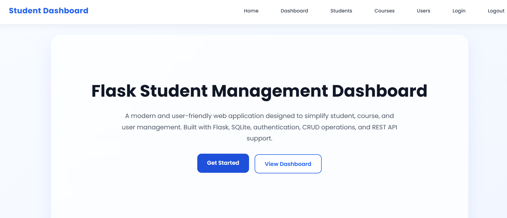
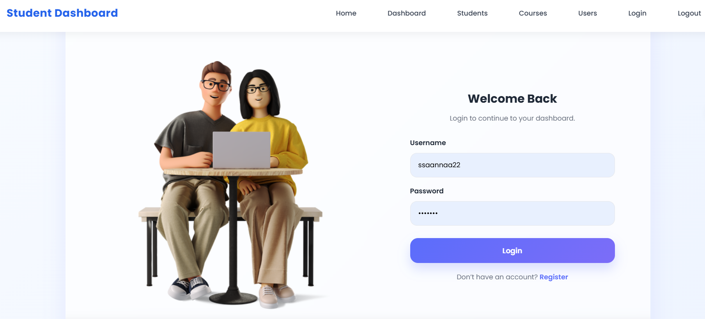
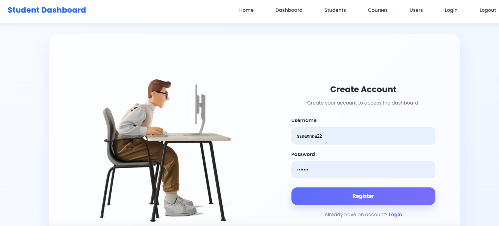
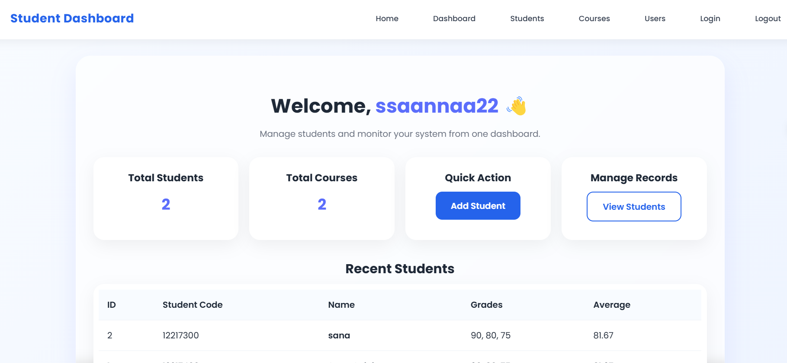
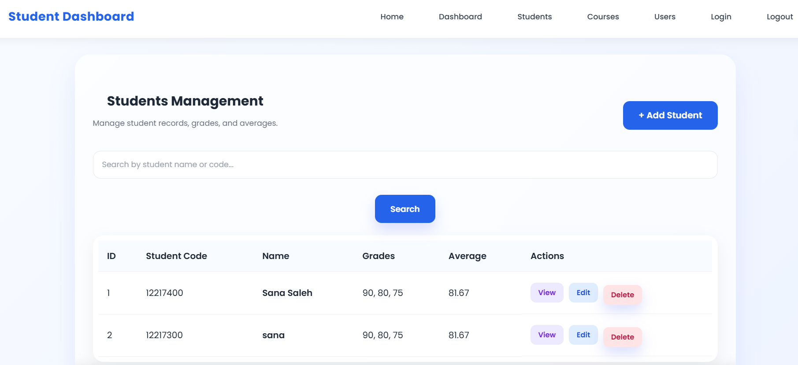
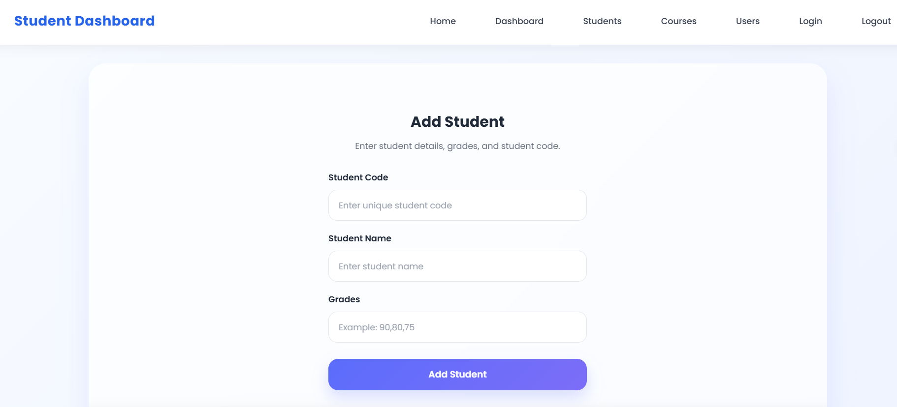
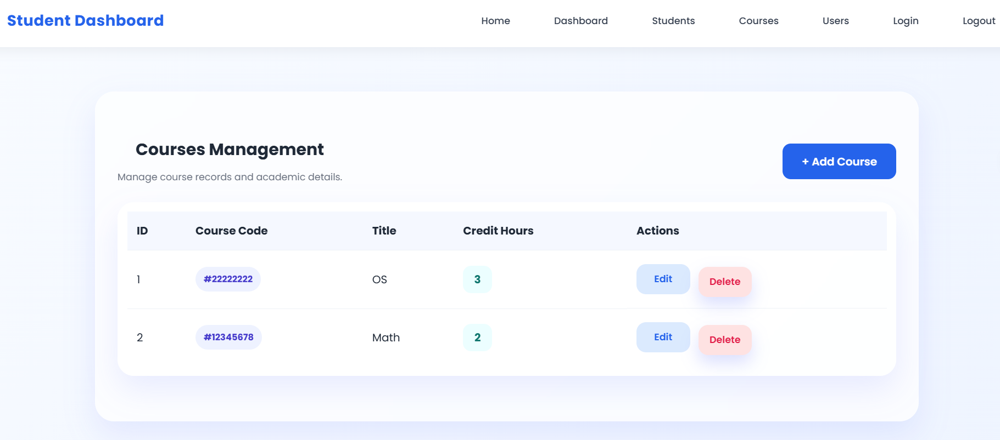
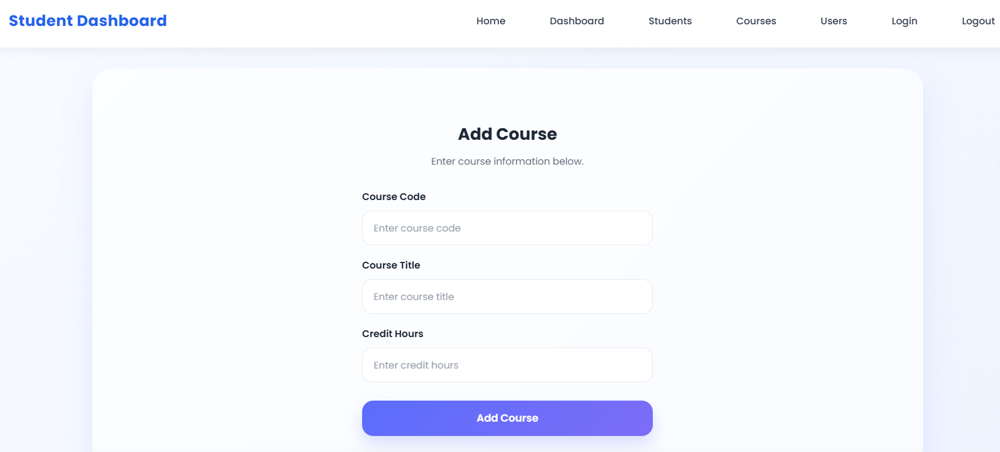
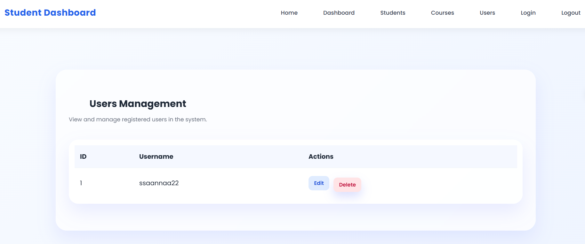

# 🎓 Flask Student Management Dashboard

A full-featured web application built using Flask for managing students, courses, and users with authentication, dashboard, and REST API.

---

## 🚀 Features

### 🔐 Authentication System
- Register new users
- Login / Logout
- Secure password hashing
- Protected routes

---

### 👩‍🎓 Student Management
- Add, edit, delete students (CRUD)
- Store grades and calculate average
- Search by name or student code 🔍
- Student details page

---

### 📚 Course Management
- Add, edit, delete courses

---

### 📊 Dashboard
- Overview stats
- Quick actions
- Recent students

---

### 🌐 REST API
- GET /api/students
- POST /api/students
- PUT /api/students/<id>
- DELETE /api/students/<id>

---

### 🧪 Testing
- Pytest test suite
- 17 tests passing ✅

---

## 🛠️ Technologies
- Flask
- SQLAlchemy
- SQLite
- HTML + Jinja
- CSS
- Pytest

---

## ⚙️ Setup

```bash
git clone https://github.com/SanaMahmoodd/Flask-Student-Management-Dashboard.git

python -m venv venv

venv\Scripts\activate

pip install -r requirements.txt

python run.py
```

---

## 📸 Screenshots

### 🏠 Home Page


### 🔐 Login Page


### 📝 Register Page


### 📊 Dashboard


### 👩‍🎓 Students Page


### ➕ Add Student


### 📚 Courses Page


### ➕ Add Courses


### Users Page


---

## 💡 Future Improvements
- Pagination
- Deployment
- Roles

---

## 👩‍💻 Author
Sana Mahmood
